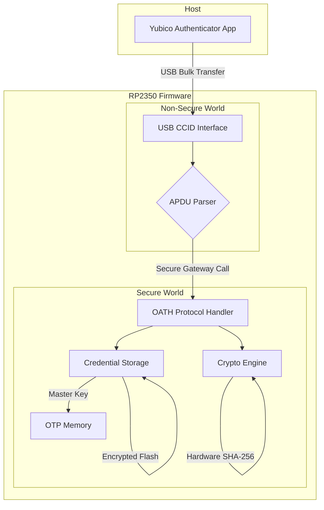

# RP2350-OATH: Firmware 2FA Open-Source com Segurança Reforçada

[](https://opensource.org/licenses/Apache-2.0)
[](https://www.raspberrypi.com/documentation/microcontrollers/pico-series.html)
[](docs/SECURITY_IMPLEMENTATION.md)

**Um token de autenticação de dois fatores (2FA) open-source, seguro e compatível com Yubico Authenticator, baseado no microcontrolador RP2350.**

---

## 🎯 Visão Geral

O **RP2350-OATH** é um projeto de firmware que transforma o microcontrolador Raspberry Pi RP2350 em um dispositivo de autenticação de dois fatores (2FA) **seguro** e totalmente funcional. Ele implementa o protocolo OATH (TOTP/HOTP) sobre uma interface USB CCID (Smart Card), permitindo que seja gerenciado pelo aplicativo **Yubico Authenticator**.

Esta versão 2.0 do projeto foi atualizada para aproveitar ao máximo os **recursos de segurança integrados em hardware** do RP2350, oferecendo uma alternativa robusta, auditável e de baixo custo às soluções comerciais.

## ✨ Principais Recursos (Versão 2.0)

- ✅ **Compatibilidade com Yubico Authenticator**: Gerenciamento de credenciais através de um aplicativo confiável e multiplataforma.
- ✅ **Protocolo OATH**: Suporte para TOTP (Time-based One-Time Passwords) e HOTP (HMAC-based One-Time Passwords).
- ✅ **Interface USB CCID**: Emulação de um leitor de Smart Card para comunicação com o host.
- ✅ **Segurança Reforçada por Hardware**:
    - **Secure Boot**: Garante que apenas firmware assinado e autorizado seja executado.
    - **Armazenamento de Chaves em OTP**: A chave mestra de criptografia é armazenada na memória OTP (One-Time Programmable), tornando-a permanente e ilegível por software.
    - **Isolamento com TrustZone**: Separação de hardware entre o mundo seguro (operações criptográficas) e o mundo não seguro (interface USB).
    - **Criptografia Acelerada por Hardware**: Uso do acelerador SHA-256 de hardware para operações HMAC.
- ✅ **Open-Source**: Firmware totalmente auditável e customizável (licença Apache 2.0).

## 🏗️ Arquitetura de Segurança com TrustZone (Fase 2 - TF-M)

A arquitetura do firmware foi refatorada para a Fase 2, separando o código em dois diretórios principais que representam os mundos isolados por hardware.

| Diretório | Domínio | Conteúdo |
|---|---|---|
| `secure_world/` | **Secure World (SW)** | OATH Protocol, Crypto Engine (AES, HMAC), Secure Storage (OTP, Flash Criptografada). |
| `non_secure_world/` | **Non-Secure World (NSW)** | USB CCID Driver (TinyUSB), Comunicação Serial (stdio), Lógica de Inicialização. |

A arquitetura do firmware é dividida em dois mundos isolados por hardware, aproveitando a tecnologia Arm TrustZone do Cortex-M33 para proteger as operações e dados mais sensíveis.



## 🚀 Começando

### Pré-requisitos

- **Hardware**: Módulo RP2350-USB (ou Raspberry Pi Pico 2)
- **Software**:
    - [Raspberry Pi Pico SDK](https://github.com/raspberrypi/pico-sdk)
    - CMake (>= 3.13)
    - Compilador ARM GCC
    - Git

### Instalação

1. **Clone o repositório:**

```bash
git clone https://github.com/seu-usuario/rp2350-oath.git
cd rp2350-oath
```

2. **Inicialize os submódulos (libcotp):**

```bash
git submodule update --init --recursive
```

3. **Compile o firmware:**

```bash
mkdir build
cd build
cmake ..
make
```

4. **Assine e Grave o Firmware (Secure Boot):**

Consulte o guia **[SECURITY_IMPLEMENTATION.md](docs/SECURITY_IMPLEMENTATION.md)** para obter instruções detalhadas sobre como gerar suas chaves, gravar o hash na OTP e assinar o firmware para habilitar o Secure Boot.

## 📖 Documentação

- **[README.md](README.md)**: Visão geral do projeto e instruções de uso.
- **[DESIGN_AND_IMPLEMENTATION.md](docs/DESIGN_AND_IMPLEMENTATION.md)**: Visão geral da arquitetura e decisões de design (v2.0 com segurança).
- **[SECURITY_IMPLEMENTATION.md](docs/SECURITY_IMPLEMENTATION.md)**: Guia detalhado para configurar o Secure Boot, OTP e TrustZone.
- **[PROTOCOL.md](docs/PROTOCOL.md)**: Detalhes sobre o protocolo YKOATH implementado.
- **[API.md](docs/API.md)**: Referência da API interna do firmware.

## 🗺️ Roadmap (Revisado)

- **Fase 1: MVP com Segurança Essencial (6 semanas)** ✅ **CONCLUÍDA**
    - ✅ Implementar a interface USB CCID customizada com TinyUSB.
    - ✅ Integrar `libcotp` para geração de TOTP.
    - ✅ Implementar o armazenamento de credenciais **criptografadas** na flash.
    - ✅ Implementar o armazenamento da **chave mestra na OTP**.
    - ✅ Configurar o projeto para **Secure Boot**.

- **Fase 2: Implementação do TrustZone (8 semanas)** 🚧 **EM ANDAMENTO (Esqueleto Criado)**
    - ✅ Refatorar o código para separar os mundos Seguro e Não Seguro (Estrutura de diretórios criada).
    - ✅ Configuração do Build System (CMake) para compilação separada (SW/NSW).
    - ✅ Definição dos Linker Scripts (.ld) para isolamento de memória (Flash/RAM).
    - 🚧 Implementar o Secure Gateway (NSC) e tabela de vetores.
    - 🔜 **Próximo Passo**: Verificação do boot e chamadas entre mundos (Secure Callable).

- **Fase 3: Recursos Avançados (a definir)** 🔜
    - Suporte a HOTP, proteção por senha e política de toque.

## 🤝 Contribuindo

Contribuições são bem-vindas! Sinta-se à vontade para abrir issues ou pull requests.

## 📄 Licença

Este projeto está licenciado sob a **Apache License 2.0** - veja o arquivo [LICENSE](LICENSE) para mais detalhes.

---

**Desenvolvido com ❤️ pela comunidade open-source.**
