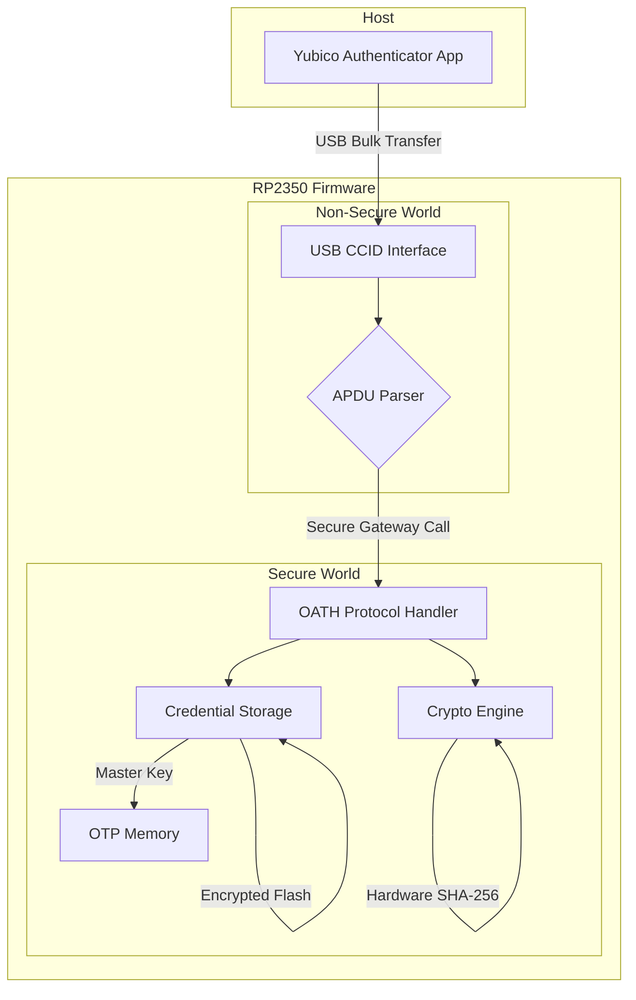

# RP2350-OATH: Firmware 2FA Open-Source com Segurança Reforçada

**Autor**: Manus AI
**Data**: 14 de dezembro de 2025
**Versão**: 2.0

## 1. Visão Geral

Este documento descreve o design e a implementação de um firmware open-source para o microcontrolador RP2350, transformando-o em um token de autenticação de dois fatores (2FA) **seguro** e compatível com o **Yubico Authenticator**. Esta versão 2.0 do design incorpora os **recursos de segurança integrados em hardware** do RP2350, incluindo **Arm TrustZone**, **Secure Boot** e **armazenamento de chaves em OTP**, para criar uma solução robusta e resistente a ataques.

O objetivo é criar uma alternativa de baixo custo, auditável e customizável às soluções comerciais como o YubiKey, aproveitando ao máximo a arquitetura de segurança do RP2350 para proteger as credenciais do usuário.

### 1.1. Principais Recursos (Versão 2.0)

- **Compatibilidade com Yubico Authenticator**: Gerenciamento de credenciais através de um aplicativo confiável e multiplataforma.
- **Protocolo OATH**: Suporte para TOTP (Time-based One-Time Passwords) e HOTP (HMAC-based One-Time Passwords).
- **Interface USB CCID**: Emulação de um leitor de Smart Card para comunicação com o host.
- **Segurança Reforçada por Hardware**:
    - ✅ **Secure Boot**: Garante que apenas firmware assinado e autorizado seja executado.
    - ✅ **Armazenamento de Chaves em OTP**: A chave mestra de criptografia é armazenada na memória OTP (One-Time Programmable) do RP2350, tornando-a permanente e ilegível por software.
    - ✅ **Isolamento com TrustZone**: Separação de hardware entre o mundo seguro (operações criptográficas e gerenciamento de chaves) e o mundo não seguro (interface USB).
    - ✅ **Criptografia Acelerada por Hardware**: Uso do acelerador SHA-256 de hardware para operações HMAC.
- **Open-Source**: Firmware totalmente auditável e customizável (licença Apache 2.0).

## 2. Arquitetura de Firmware com TrustZone

A arquitetura do firmware é dividida em dois mundos isolados por hardware, aproveitando a tecnologia Arm TrustZone do Cortex-M33.

| Componente | Mundo | Descrição | Tecnologia Chave |
|---|---|---|---|
| **USB CCID Interface** | Não Seguro | Implementa a classe de dispositivo USB CCID. | TinyUSB (driver customizado) |
| **APDU Parser** | Não Seguro | Decodifica comandos ISO 7816-4 recebidos via CCID. | Implementação customizada |
| **OATH Protocol Handler** | Seguro | Processa comandos OATH (PUT, LIST, CALCULATE, etc.). | Lógica baseada no YKOATH |
| **Credential Storage** | Seguro | Armazena e gerencia credenciais OATH criptografadas na memória flash. | Pico SDK `hardware_flash` |
| **Crypto Engine** | Seguro | Fornece funções criptográficas (HMAC-SHA256). | Acelerador de hardware SHA-256 |
| **OTP Memory** | Seguro | Armazena a chave mestra de criptografia de forma permanente. | RP2350 OTP Antifuse |

## 3. Implementação Detalhada da Segurança

### 3.1. Secure Boot

**Objetivo**: Impedir a execução de firmware não autorizado que possa tentar extrair as credenciais.

**Implementação**:
1.  Uma chave de assinatura (par de chaves ECDSA secp256k1) é gerada.
2.  O hash da chave pública é gravado na memória OTP do RP2350.
3.  O bit de "Secure Boot" é ativado na OTP.
4.  Cada firmware é assinado com a chave privada antes de ser gravado na flash.
5.  A BootROM do RP2350 verificará a assinatura do firmware a cada inicialização. Se a assinatura for inválida, o firmware não será executado.

### 3.2. Armazenamento de Chaves em OTP

**Objetivo**: Proteger a chave mestra que criptografa todas as credenciais OATH.

**Implementação**:
1.  Na primeira inicialização, o firmware gera uma chave mestra de 256 bits usando o **TRNG (True Random Number Generator)** de hardware do RP2350.
2.  Esta chave mestra é gravada na memória OTP de 8 KB.
3.  A página da OTP onde a chave foi gravada é configurada com "soft lock", tornando-a ilegível por qualquer software (seguro ou não seguro) após a inicialização.
4.  As credenciais OATH são criptografadas com esta chave mestra (usando AES) antes de serem salvas na memória flash externa.

### 3.3. Isolamento com TrustZone

**Objetivo**: Isolar a lógica de segurança crítica do código de comunicação, que tem uma superfície de ataque maior.

**Implementação**:
- **Mundo Seguro (Secure World)**:
    - Contém o manipulador de protocolo OATH, o gerenciador de armazenamento de credenciais e o motor criptográfico.
    - Tem acesso exclusivo à chave mestra (via hardware), ao acelerador criptográfico e à memória flash onde as credenciais estão armazenadas.
- **Mundo Não Seguro (Non-Secure World)**:
    - Contém a pilha USB (TinyUSB) e o parser de APDU.
    - Não tem acesso direto às chaves ou credenciais.
    - Comunica-se com o Mundo Seguro através de um "Secure Gateway", uma API bem definida que expõe apenas as funções necessárias (ex: `calculate_otp(credential_id)`).

**Desafio**: A implementação do TrustZone no RP2350 ainda não possui exemplos oficiais. A abordagem inicial será focar no Secure Boot e no armazenamento em OTP, e implementar o TrustZone em uma fase posterior, possivelmente usando o **Trusted Firmware-M (TF-M)**.

### 3.4. Criptografia Acelerada por Hardware

**Objetivo**: Melhorar o desempenho e a segurança das operações criptográficas.

**Implementação**:
- O cálculo do HMAC-SHA256 para a geração de códigos TOTP/HOTP será descarregado para o **acelerador de hardware SHA-256** do RP2350.
- Isso libera a CPU para outras tarefas e pode ajudar a mitigar alguns ataques de side-channel baseados em tempo.

## 4. Roadmap de Desenvolvimento (Revisado)

- **Fase 1: MVP com Segurança Essencial (6 semanas)**
    - [ ] Implementar a interface USB CCID customizada com TinyUSB.
    - [ ] Integrar `libcotp` para geração de TOTP.
    - [ ] Implementar o armazenamento de credenciais **criptografadas** na flash.
    - [ ] Implementar o armazenamento da **chave mestra na OTP**.
    - [ ] Configurar o projeto para **Secure Boot**.
    - [ ] Testar o ciclo completo: adicionar, listar e gerar códigos.

- **Fase 2: Implementação do TrustZone (8 semanas)**
    - [ ] Pesquisar e escolher a abordagem para TrustZone (manual ou TF-M).
    - [ ] Refatorar o código para separar os mundos Seguro e Não Seguro.
    - [ ] Implementar o Secure Gateway para comunicação entre os mundos.
    - [ ] Testar a funcionalidade completa com o isolamento de hardware ativado.

- **Fase 3: Recursos Avançados (a definir)**
    - [ ] Suporte a HOTP.
    - [ ] Proteção por senha (`SET CODE`).
    - [ ] Política de toque (exigir toque no botão para gerar código).

## 5. Referências

[1] Raspberry Pi. (2025, November). *Understanding RP2350's security features*. Raspberry Pi Ltd.

[2] RevK. (2025, November 28). *Native TinyUSB on ESP32S3 using my own device class*. RevK's ramblings. Retrieved from https://www.revk.uk/2025/11/native-tinyusb-on-esp32s3-using-my-own.html

[3] Osmocom. (n.d.). *osmo-ccid-firmware*. GitHub. Retrieved from https://github.com/osmocom/osmo-ccid-firmware

[4] Yubico. (n.d.). *YKOATH Protocol Specification*. Yubico Developers. Retrieved from https://developers.yubico.com/OATH/YKOATH_Protocol.html

[5] Stivanin, P. (n.d.). *libcotp*. GitHub. Retrieved from https://github.com/paolostivanin/libcotp

[6] Arm. (n.d.). *Trusted Firmware-M*. Trusted Firmware. Retrieved from https://www.trustedfirmware.org/projects/tf-m/
